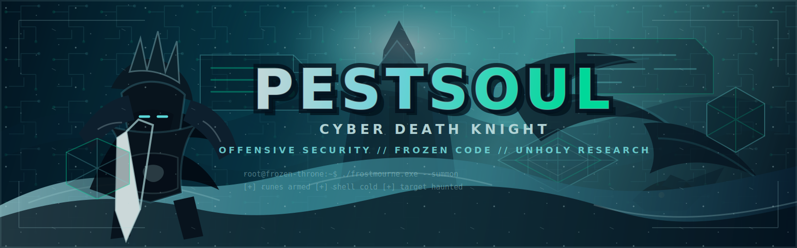

<!--
  Pestsoul GitHub Profile - Cyber-Death Knight Edition
  Where darkness meets digital warfare
-->

<div align="center">

<!-- Hero Banner -->


<br />

<!-- Badges -->
<a href="https://github.com/Pestsoul">
  
</a>


<br /><br />

<!-- Typing Effect -->


</div>

---

<div align="center">

</div>

---

## ⚔️ THE DARK COVENANT // IDENTITY

```yaml
name: Pestsoul
title: Cyber-Death Knight of the Frozen Code
level: ∞  # Eternal Growth in Darkness
allegiance: Independent - Servant of Security
domain: The Shadowlands of Cyberspace

unholy_powers:
  primary_school:
    - Offensive Security (Unholy Strike)
    - Penetration Testing (Death Grip)
    - Vulnerability Research (Plague Strike)
    - Exploit Development (Necrotic Touch)
  
  frost_school:
    - Network Security (Frost Nova)
    - Defensive Operations (Ice Barrier)
    - Threat Hunting (Frozen Orb)
    - SIEM Analysis (Glacial Spike)
  
  blood_school:
    - Malware Analysis (Blood Boil)
    - Reverse Engineering (Death and Decay)
    - Digital Forensics (Vampiric Touch)
    - Binary Exploitation (Rune Tap)

combat_stance: Unholy Presence - Overwhelming offense
armor_type: Blackened Code & Runic Defenses
weapon: Frostmourne.exe - The Cursed Binary Blade
mount: Spectral Botnet Steed
motto: "There is no escape from the cold embrace of 0day"
creed: |
  "I was a defender once, until I took a 0day to the kernel.
   Now I walk the path of eternal exploitation,
   Commanding armies of shellcode and buffer overflows.
   In death, there is power. In bugs, there is opportunity."
```

**Risen from the ashes of failed defenses**, I traverse the digital necropolis, wielding exploits as my unholy weapons. My purpose: to break what cannot be broken, to find weakness in strength, to prove that **all systems eventually fall**.

---

## 💀 RUNEBLADE ARSENAL // TECH STACK

<div align="center">

### ⚰️ Primary Weapons (Languages of Death)

<p>
  
  
  
  
  
  
  
</p>

### 🗡️ Artifacts of Power (Tools & Frameworks)

<p>
  
  
  
  
  
  
</p>

</div>

---

## 🏴‍☠️ UNHOLY TALENTS // SECURITY DOMAINS

<table>
  <tr>
    <td width="50%" valign="top">
      
### ⚔️ UNHOLY (Offensive Mastery)
```diff
+ Penetration Testing
+ Web Application Hacking
+ Exploit Development
+ Vulnerability Research
+ Social Engineering
+ Network Intrusion
+ OSINT & Reconnaissance
+ Privilege Escalation
+ Post-Exploitation
+ Red Team Operations
```

**Signature Abilities:**
- 🩸 **Death Coil**: Remote code execution
- ⚡ **Unholy Frenzy**: Rapid exploitation chains
- 💀 **Army of the Dead**: Botnet orchestration
- 🌑 **Dark Transformation**: Payload morphing


</td>
<td width="50%" valign="top">

### 🛡️ FROST (Defensive Warcraft)
```diff
+ Threat Intelligence
+ Incident Response
+ SIEM & Log Analysis
+ Network Traffic Analysis
+ Security Hardening
+ Threat Hunting
+ Malware Triage
+ Endpoint Protection
+ Security Orchestration
+ Blue Team Tactics
```

**Signature Abilities:**
- ❄️ **Icebound Fortitude**: System hardening
- 🌨️ **Howling Blast**: Threat detection
- 🧊 **Glacial Advance**: Proactive hunting
- 💎 **Anti-Magic Shell**: EDR/XDR deployment


</td>
</tr>
<tr>
<td width="50%" valign="top">

### 🩸 BLOOD (Forensic Necromancy)
```diff
+ Malware Analysis
+ Reverse Engineering
+ Digital Forensics
+ Memory Forensics
+ Disk Forensics
+ Network Forensics
+ Timeline Analysis
+ Artifact Recovery
+ Evidence Preservation
+ Chain of Custody
```

**Signature Abilities:**
- 🧛 **Vampiric Blood**: Data extraction
- 💉 **Blood Plague**: Malware dissection
- 🫀 **Heart Strike**: Core dump analysis
- 🩸 **Dancing Rune Weapon**: Automated analysis


</td>
<td width="50%" valign="top">

### 🔮 RUNEFORGING (Advanced Tradecraft)
```diff
+ Binary Exploitation
+ Shellcode Development
+ Rootkit Development
+ Kernel Exploitation
+ Cryptanalysis
+ Steganography
+ Sandbox Evasion
+ Anti-Forensics
+ Code Obfuscation
+ Custom Tool Development
```

**Signature Abilities:**
- 🔱 **Rune of the Fallen Crusader**: Privilege escalation
- ⚒️ **Rune of Razorice**: Encryption breaking
- 🗡️ **Rune of the Stoneskin**: Anti-detection
- 💠 **Rune of Hysteria**: Persistence mechanisms


</td>
</tr>
</table>

---

## 📜 SCOURGE CAMPAIGNS // ACTIVE PROJECTS

<div align="center">

| 🗡️ Campaign Name | Domain | Rune Power | Status |
|:----------------|:------:|:----------:|:------:|
| **Frostmourne Framework** | Multi-Domain | Python/Rust | ⚔️ Active Development |
| **Plague Scanner** | Web Security | Go | 💀 Spreading |
| **Undead Debugger** | Reverse Engineering | C/Assembly | 🧟 Reanimating |
| **Frozen Shell** | Exploit Development | Python | ❄️ Crystallizing |
| **Death Knight's Toolkit** | All Domains | Mixed | 🏴‍☠️ Eternal Project |
| **Lich King's Grimoire** | Research/Writeups | Markdown | 📖 Documenting Darkness |

</div>

---

## 🏆 HALL OF THE FROZEN THRONE // ACHIEVEMENTS

<div align="center">

```ascii
╔═══════════════════════════════════════════════════════════════╗
║                  ⚔️ LEGENDARY CONQUESTS ⚔️                    ║
╠═══════════════════════════════════════════════════════════════╣
║                                                               ║
║  💀 CTF Victories - Champions of the Shadowlands             ║
║  🎖️ Security Certifications - Runemaster Achievements        ║
║  ⚡ 0days Discovered - Plagues Unleashed Upon the Realm      ║
║  📜 Research Publications - Forbidden Knowledge Shared       ║
║  🗡️ Open Source Contributions - Weapons Forged for All      ║
║  🏴‍☠️ Bug Bounties - Gold from the Fallen Kingdoms            ║
║                                                               ║
╚═══════════════════════════════════════════════════════════════╝
```

<br />

```ascii
        ⚔️                    💀                    ⚔️
       /|\                   /|\                   /|\
      / | \                 / | \                 / | \
   UNHOLY              FROST                  BLOOD
  MASTERY            DOMINION              ASCENDANCY
```

</div>

---

## 📊 POWER OF THE LICH KING // GITHUB STATS

<div align="center">


<br /><br />


<br /><br />


</div>

---

## ⚔️ TRAINING GROUNDS // BATTLEFIELDS

<div align="center">

### 🏴‍☠️ Primary Arenas

<a href="https://tryhackme.com/p/Pestsoul">
  
</a>
<a href="https://www.hackthebox.eu/profile/Pestsoul">
  
</a>
<a href="https://www.root-me.org/Pestsoul">
  
</a>

<br /><br />

### 💀 Secondary Battlegrounds


</div>

---

## 📚 GRIMOIRES OF DARKNESS // KNOWLEDGE BASE

<div align="center">

<table>
  <tr>
    <td width="33%" align="center">
      <h3>⚔️ Offensive Codex</h3>
      <sub>
        <strong>Frameworks:</strong><br />
        MITRE ATT&CK • PTES • OWASP Top 10<br />
        Kill Chain • Cyber Kill Chain<br /><br />
        <strong>Disciplines:</strong><br />
        Red Teaming • Purple Teaming<br />
        APT Simulation • Adversary Emulation<br />
        Social Engineering • Physical Security
      </sub>
    </td>
    <td width="33%" align="center">
      <h3>🛡️ Defensive Tome</h3>
      <sub>
        <strong>Frameworks:</strong><br />
        NIST CSF • ISO 27001 • CIS Controls<br />
        MITRE D3FEND • Cyber Defense Matrix<br /><br />
        <strong>Disciplines:</strong><br />
        Blue Teaming • Threat Intelligence<br />
        SOC Operations • CSIRT<br />
        Zero Trust Architecture • DevSecOps
      </sub>
    </td>
    <td width="33%" align="center">
      <h3>📜 Forensic Scrolls</h3>
      <sub>
        <strong>Frameworks:</strong><br />
        SANS DFIR • NIST SP 800-86<br />
        RFC 3227 • ISO/IEC 27037<br /><br />
        <strong>Disciplines:</strong><br />
        Incident Response • Malware RE<br />
        Memory Analysis • Timeline Analysis<br />
        Chain of Custody • Expert Testimony
      </sub>
    </td>
  </tr>
</table>

</div>

---

## 🗺️ THE PATH OF DAMNATION // ROADMAP

<div align="center">

```ascii
                            ⚔️ THE FROZEN THRONE ⚔️
                                     |
                    +----------------+----------------+
                    |                |                |
              ⚰️ UNHOLY          ❄️ FROST         🩸 BLOOD
                    |                |                |
        +-----------+----+    +------+-------+   +----+----------+
        |           |    |    |      |       |   |    |          |
    Advanced    Custom  AI   Cloud  IoT   Zero  Malware Kernel  Mobile
     Exploits   Tools  Sec  Security Hack  Day   R.E.  Exploits Pentesting
        |           |    |    |      |       |   |    |          |
        +---------------------+-------+-------+---+--------------+
                                     |
                          🏆 LEGENDARY STATUS
                       (Published Researcher &
                        Open Source Maintainer)
```

</div>

### 🎯 Immediate Conquests (Next 6 Months)
- [ ] 💀 Obtain **OSCP** certification (Offensive Security Certified Professional)
- [ ] 🔍 Complete **eLearnSecurity eCXD** (Exploit Development)
- [ ] 📝 Publish **5 detailed malware analysis** writeups
- [ ] 🏆 Achieve **Top 100** on TryHackMe
- [ ] 🛠️ Release **2 open-source security tools**
- [ ] 🎖️ Earn **Bug Bounty Hall of Fame** on major platform

### ⚡ Mid-term Campaigns (6-12 Months)
- [ ] 🧟 Complete **GREM** (GIAC Reverse Engineering Malware)
- [ ] 🔐 Master **Cloud Security** (AWS/Azure/GCP pentesting)
- [ ] 🏴‍☠️ Participate in **10+ CTF competitions** (top rankings)
- [ ] 📚 Create **YouTube channel** with security tutorials
- [ ] 💻 Contribute to **5+ major open-source projects**
- [ ] 🎯 Discover and responsibly disclose **CVEs**

### 🌑 Ultimate Quest (1-2 Years)
- [ ] 👑 Achieve **OSEE** or **OSED** certification
- [ ] 🔬 Publish **academic research** in security conferences
- [ ] 🏛️ Build reputation as **trusted security researcher**
- [ ] 🎓 Develop **comprehensive training course**
- [ ] 💼 Lead **Red Team operations** professionally
- [ ] ⚔️ Master **Advanced Persistent Threat** simulation
- [ ] 🌍 Speak at **security conferences** (DEF CON, Black Hat)

---

## 🌐 THE SCOURGE NETWORK // COMMUNITY

<div align="center">

```ascii
╔══════════════════════════════════════════════════════════════╗
║              💀 ALLIANCES IN THE SHADOWLANDS 💀              ║
╠══════════════════════════════════════════════════════════════╣
║                                                              ║
║  🤝 Open Source Security Projects                           ║
║  🏴‍☠️ CTF Teams & Elite Hacking Communities                   ║
║  🔬 Security Research Groups                                ║
║  💰 Bug Bounty Platforms (HackerOne, Bugcrowd, Intigriti)  ║
║  💬 InfoSec Discord/Slack Servers                           ║
║  📡 DEFCON Groups & Local Hacker Spaces                     ║
║  🎓 Academic Cybersecurity Programs                         ║
║                                                              ║
╚══════════════════════════════════════════════════════════════╝
```

</div>

---

## 📬 SUMMON THE DEATH KNIGHT // CONTACT

<div align="center">

<p>
  <a href="mailto:pestsoul@protonmail.com">
    
  </a>
  <a href="https://twitter.com/Pestsoul">
    
  </a>
  <a href="https://linkedin.com/in/pestsoul">
    
  </a>
  <a href="https://discord.gg/pestsoul">
    
  </a>
</p>

<br />

```ascii
╔════════════════════════════════════════════════════════════════╗
║                                                                ║
║     "I was a white-hat once, then I saw the truth...          ║
║      True security is forged in the fires of exploitation.    ║
║      Only by mastering the darkness can we defend the light." ║
║                                                                ║
║                    - Pestsoul, Death Knight                    ║
║                      of the Frozen Code                        ║
║                                                                ║
╚════════════════════════════════════════════════════════════════╝
```

<br />

### ⚔️ For Collaboration Requests

**I'm open to:**
- 🤝 Open-source security tool development
- 🔬 Joint vulnerability research
- 📚 Educational content creation
- 🏴‍☠️ CTF team formation
- 💼 Consulting on security architecture
- 🎤 Speaking engagements

**Contact me via:** Email or LinkedIn for professional inquiries

</div>

---

<div align="center">


<br />


<br /><br />

**⚰️ "There is no light... only code and chaos" ⚰️**

</div>

<!-- 
  Crafted with dark magic and debugging fury
  Theme: Cyber-Death Knight
  Inspiration: WoW Death Knight + Cyberpunk + Hacker Culture
  Color Scheme: Black (#000000, #0d1117), Toxic Green (#00ff88), 
                Blood Red (#8b0000), Frost Blue (#00ced1), 
                Unholy Purple (#6a0dad)
-->
